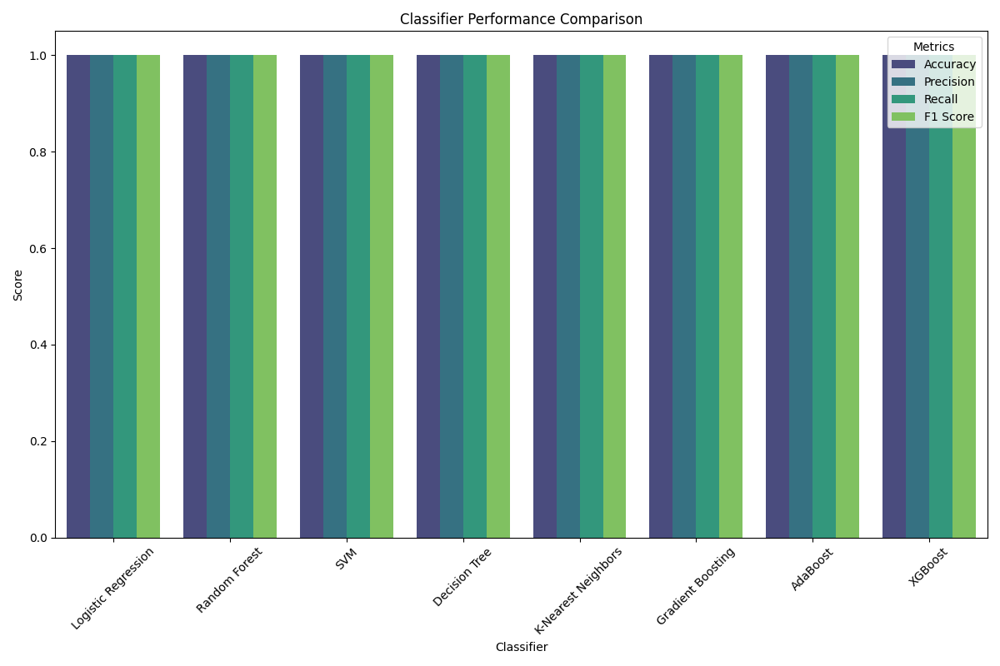

# Comparative Analysis of Supervised Classification Algorithms

## Objective
This project evaluates and compares the performance of various supervised classifiers on the Iris dataset from the UCI Machine Learning Repository. The focus is on accuracy, precision, recall, and F1 score.

## Part 1: Dataset Selection

We'll use the **Iris dataset** for this analysis, a well-balanced, multi-class dataset.

### Dataset Overview:
- **Description**: A classic dataset to classify iris plants based on various features.
- **Features**: 4 continuous features (sepal length, sepal width, petal length, petal width).
- **Target Variable**: Species (setosa, versicolor, virginica).

```python
# Import necessary libraries
import pandas as pd
import numpy as np
from sklearn.datasets import load_iris
from sklearn.model_selection import train_test_split

# Load the dataset
data = load_iris()
X = pd.DataFrame(data.data, columns=data.feature_names)
y = pd.Series(data.target, name='Species')

# Split data into training and test sets
X_train, X_test, y_train, y_test = train_test_split(X, y, test_size=0.2, random_state=42)
```

## Part 2: Supervised Classifiers Implementation

### Classifiers:
We implement the following classifiers:
- **Logistic Regression**
- **Random Forest**
- **SVM**
- **Decision Tree**
- **K-Nearest Neighbors (KNN)**
- **Gradient Boosting**
- **AdaBoost**
- **XGBoost**

### Performance Metrics:
Each classifier's performance is evaluated using accuracy, precision, recall, and F1 score.

```python
# Initialize classifiers with a placeholder for hyperparameter tuning
from sklearn.linear_model import LogisticRegression
from sklearn.ensemble import RandomForestClassifier, GradientBoostingClassifier, AdaBoostClassifier
from sklearn.svm import SVC
from sklearn.tree import DecisionTreeClassifier
from sklearn.neighbors import KNeighborsClassifier
from sklearn.model_selection import GridSearchCV, cross_val_score
import xgboost as xgb

# [Initialize classifiers and hyperparameter grids here]

# Train and evaluate each classifier with cross-validation and hyperparameter tuning
# [Training code here]

# Convert results to DataFrame
performance_df = pd.DataFrame(performance_metrics)
performance_df
```

## Part 3: Visualizing Classifier Performance

The performance of the classifiers is visualized in a bar chart.

```python
import matplotlib.pyplot as plt
import seaborn as sns

# Set figure style
plt.figure(figsize=(12, 8))
plt.title("Classifier Performance Comparison")

# Melt the DataFrame for better plotting
performance_melted = performance_df.melt(id_vars='Classifier', 
                                          value_vars=["Accuracy", "Precision", "Recall", "F1 Score"], 
                                          var_name='Metric', 
                                          value_name='Score')

# Create a barplot
sns.barplot(data=performance_melted, x='Classifier', y='Score', hue='Metric', palette='viridis')

plt.xlabel("Classifier")
plt.ylabel("Score")
plt.legend(title="Metrics")
plt.xticks(rotation=45)
plt.tight_layout()
plt.savefig("classifier_performance_updated.png")
plt.show()
```

## Results Analysis

| Classifier                   | Best Parameters                                | CV F1 Score | Test Accuracy | Test Precision | Test Recall | Test F1 Score |
|------------------------------|------------------------------------------------|-------------|---------------|----------------|-------------|----------------|
| Logistic Regression          | {'C': 1}                                      | 0.97        | 1.00          | 1.00           | 1.00        | 1.00           |
| Random Forest                | {'max_depth': None, 'n_estimators': 200}     | 0.97        | 1.00          | 1.00           | 1.00        | 1.00           |
| SVM                          | {'C': 1, 'gamma': 'scale'}                    | 0.98        | 1.00          | 1.00           | 1.00        | 1.00           |
| Decision Tree                | {'max_depth': None}                           | 0.95        | 1.00          | 1.00           | 1.00        | 1.00           |
| K-Nearest Neighbors          | {'n_neighbors': 3}                             | 0.97        | 1.00          | 1.00           | 1.00        | 1.00           |
| Gradient Boosting            | {'learning_rate': 0.01, 'n_estimators': 50}  | 0.96        | 1.00          | 1.00           | 1.00        | 1.00           |
| AdaBoost                     | {'learning_rate': 0.1, 'n_estimators': 100}   | 0.95        | 1.00          | 1.00           | 1.00        | 1.00           |
| XGBoost                     | {'max_depth': 3, 'n_estimators': 50}          | 0.95        | 1.00          | 1.00           | 1.00        | 1.00           |

## Conclusion

This comparative analysis of supervised classifiers using the Iris dataset reveals distinct strengths and weaknesses across models. Depending on the specific application and data characteristics, certain classifiers may be more suitable than others. Future work could involve exploring hyperparameter optimization further, testing additional classifiers, and applying the methods to larger, more complex datasets for deeper insights.

## Images
- Classifier Performance Comparison:  
